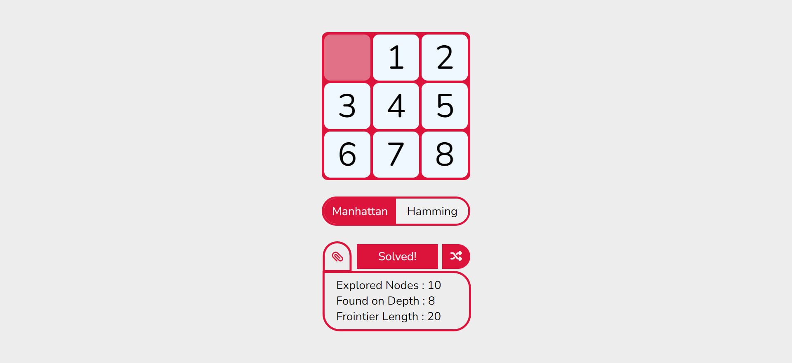
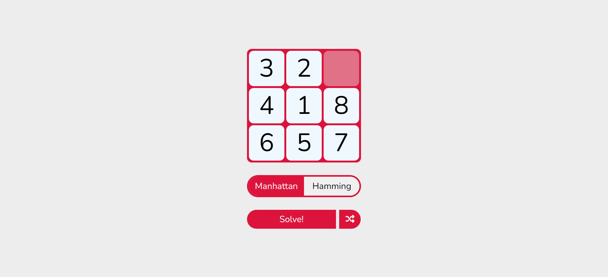

# 8-Puzzle

# General Overview:

I think you all know [8-Puzzle](https://en.wikipedia.org/wiki/15_Puzzle) . and solving this problem is one of the most intersing parts of learning AI.

# Project Objective : 
solving 8 Puzzle problem with [A*](https://en.wikipedia.org/wiki/A*_search_algorithm) algorythm and using Manhattan and Hamming Heuristics.

# Game Analysis:
First, randomly shuffle the game state, then select your desired Heuristic and wait until the app solve it and show you the answer!

# All you need to know beforehand

- [A* Algorythm](https://en.wikipedia.org/wiki/A*_search_algorithm)
- [Manhattan Distance](https://en.wikipedia.org/wiki/Taxicab_geometry)
- [Hamming Distance](https://en.wikipedia.org/wiki/Hamming_distance)
